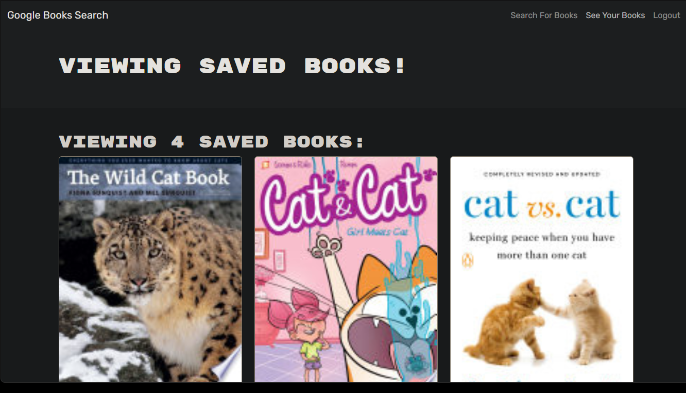

# Librarian

Live URL: https://librarian-ai41.onrender.com/

Repo URL: https://github.com/alexilson/librarian

## Description
"Librarian" is a sophisticated web application designed to streamline your reading experience. Harnessing the power of cutting-edge technologies like GraphQL, Express, MongoDB, React, Node.js, and JWT for authentication, Librarian offers users a seamless platform to manage their personal library online.

At its core, Librarian enables users to create accounts securely, allowing them to curate their own digital bookshelves with ease. Leveraging the extensive database of Google Books, users can effortlessly search for and save their favorite titles directly to their library within the app.

## Table of Contents
[Installation](#installation)

[Usage](#usage)

[License](#license)

[Questions](#questions)

## Installation
Clone the repository, change into the directory, and run "npm install". Then run "npm start". If you want to run the whole kit-and-kaboodle locally, run "npm run develop".

## Usage
Click Sign Up, enter a username, email and password. Then, once your account is created, search for a book name. You will get a list of results, just click Add Book for any books you woul dlike to save.The books are viewable by clicking See My Saved Books.

## License

## Questions
For additional questions, please contact me here:

GitHub: https://www.github.com/alexilson

Email: ilson.alex@gmail.com
